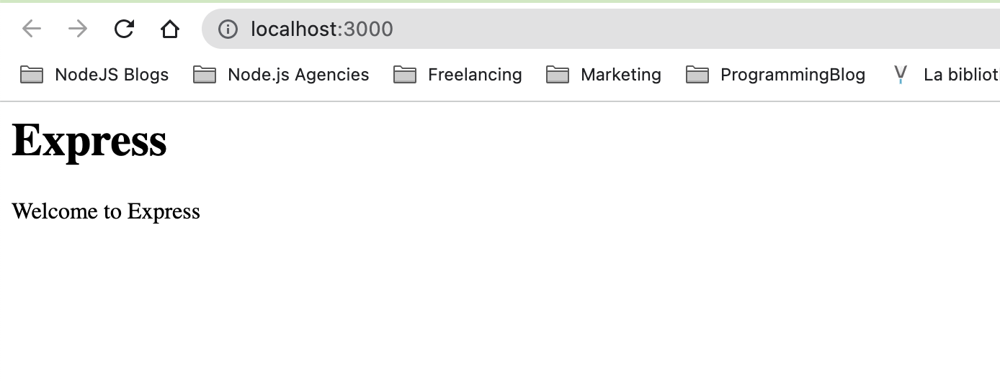

# 01-recipe-building-web-app-w-express 

[Express.js](http://www.expressjs.com) or Express, has been and remains the most popular web framework for building web applications in Node.js. Express was one of the first Node.js web frameworks and was based on the **Sinatra** web framework for **Ruby and Rails**. Express.js was a project of the [**OpenJS Foundation**](http://www.openjsf.org/projects/), and previously the Node.js Foundation.js.

In this project, we will look at how to create an Express.js web server.

## Getting ready

To get started, we'll create a folder named 01-recipe-building-web-app-w-express  and initialize our project by running the following commands:

```bash
    $ mkdir 01-recipe-building-web-app-w-express 
    $ cd 01-recipe-building-web-app-w-express 
    $ npm init --yes
```

## How to do it?

In this project, we'll create a web server that responds on the / route using Express.js

1. First, let's start by installing express

    ```bash
        $ npm install express
    ```

2. Now, we need to create a few directories and files for our web application. While in our **01-recipe-building-web-app-w-express** directory, enter the following commands in our terminal:

    ```bash
        $ touch app.js
        $ mkdir routes public
        $ touch routes/index.js public/styles.css
    ```

3. Our **app.js** file is where we instantiate **express**. Let's import the following dependencies in our **app.js**

    ```js
        const express = require('express')
        const path = require('path')
        const index = require('./routes/index')
    ```

4. Next, let's define the port for our Express.js server:

    ```js
        const PORT = process.env.PORT || 3000
    ```

5. Now, we can initialize express:

    ```js
        const app = express()
    ```

6. Next, we need to register the **static** Express.js middleware to host the public directory. We'll also mount our **index** route:

    ```js
        app.use(express.static(path.join(__dirname, 'public')))
        app.use('/', index)
    ```

7. Finally, in **app.js**, we need to start our Express server on our specified port:

    ```js
        app.listen(PORT, () => {
            console.log(`Server listening on port ${PORT}`)
        })
    ```

8. We now need to add our route handling in **index.js** file that is within the **routes** directory. Add the following to **index.js**:

    ```js
        const express = require('express')
        const router = express.Router()

        router.get('/', (req, res) => {
            const title = 'Express'
            res.send(`
                <html>
                    <head>
                        <title>${title}</title>
                        <link rel="stylesheet" href="styles.css">
                    </head>
                    <body>
                        <h1>${title}</h1>
                        <p>Welcome to ${title}</p>
                    </body>
                </html>
            `)
        })

        module.exports = router
    ```

9. Now we can add some styling to our application using **Cascading Style Sheet (CSS)**. Let's add the following to **public/styles.css**

    ```css
        body {
            padding: 50px;
            font: 14px "Lucida Grande", Helvetica, Arial, sans-serif;
        }
    ```

10. Now we can start our Express.js server by running the following command:

    ```bash
        $ node app.js
        Server listening on port 3000
    ```

11. If we navigate to [http://localhost:3000](http://localhost:3000), we should expect to see the following output in our browser:



Now we've created an Express.js web server that responds with an HTML page on the / route.

## How it works

The Express.js framework abstract the underlying Node.js core web protocol APIs provided by the **http** and **https** core modules. Express.js provides an interface for routing and adding middleware.

The line `const app = express()` is where we create our Express.js server, where **app** represents the server.

The `app.use()` function is used to register middleware. In the context of Express.js